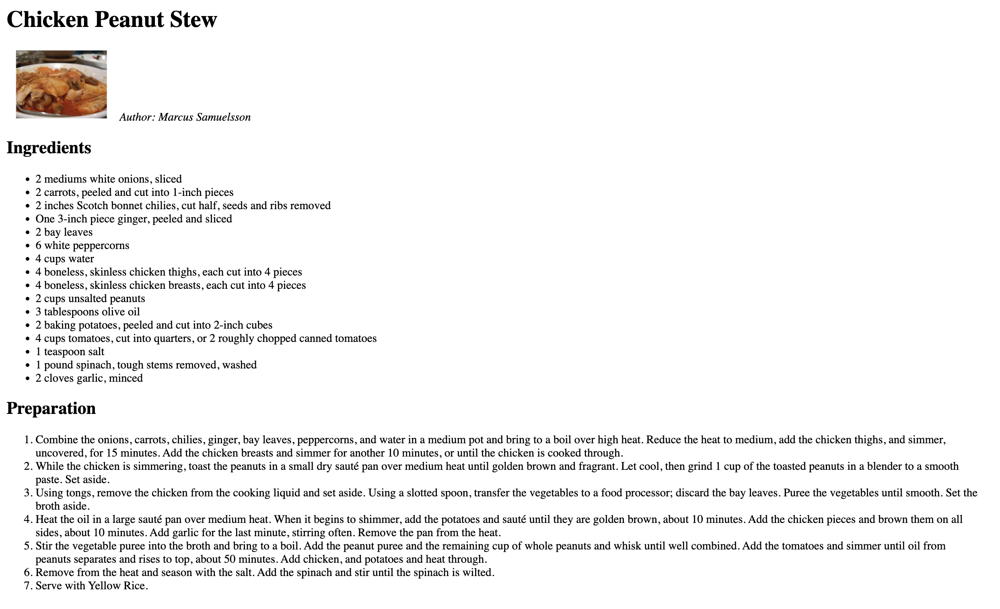

# Chicken Peanut Stew Recipe Page

Who doesn't love a great recipe?

In this exercise, you'll take a recipe that's written in text and turn it into an HTML page. You'll practice choosing the appropriate elements for different pieces of information and writing the HTML from scratch.

## Your Task

In `recipe.txt`, there's a recipe for Chicken Peanut Stew. Choose the appropriate HTML elements for each of the parts of the recipe, and write the HTML in `index.html`.

* use heading elements for the title of the recipe, the Ingredients, and Preparation sections.
* use list elements for the list of ingredients and the list of steps. (What kinds of lists should they be?)
* use an image element to include the picture of the dish, `chicken-peanut-stew.jpeg`

Once you have added all the elements and tested how your site looks, submit the exercise.

Here's roughly what the site should look like when you finish:

[(Click for a larger image)](https://chicken-peanut-stew-recipe-page.kibo-web.repl.co/finished-recipe.png)

## Bonus

Try these only after you've completed the task and submitted the exercise.

**Add some style**
`style.css` has just one rule to add some spacing around the recipe on the page. You can add your own styles to the page to make it more appealing.

**Your take on the recipe**
People have strong opinions about food. 

Do you have your own twist on the recipe? Change up the ingredients or the steps in the preparation, and add your own introduction to why you like the recipe that way.

**Attribution**

Recipe adapted from https://www.foodista.com/recipe/MPYMQBPD/chicken-peanut-stew, which got the recipe from Marcus Samuelsson's The Soul of a New Cuisine: A Discovery of the Foods and Flavors of Africa.

